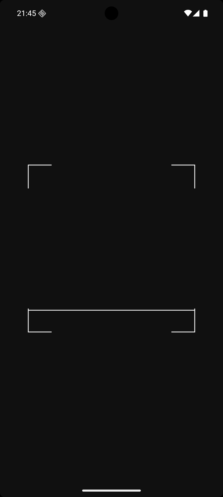
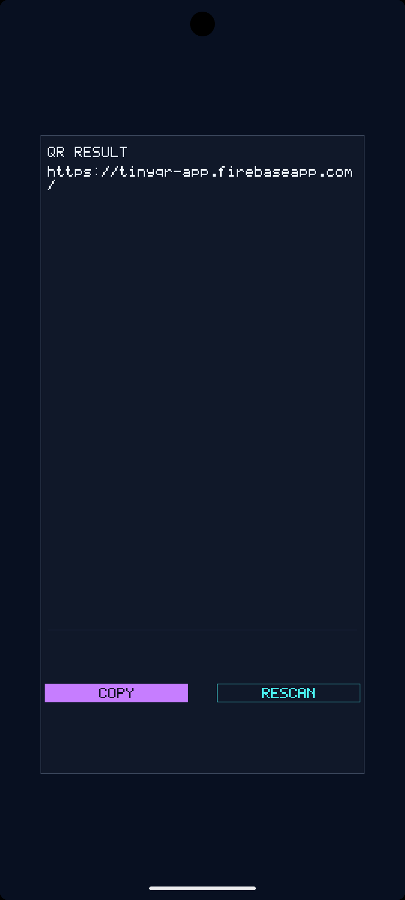
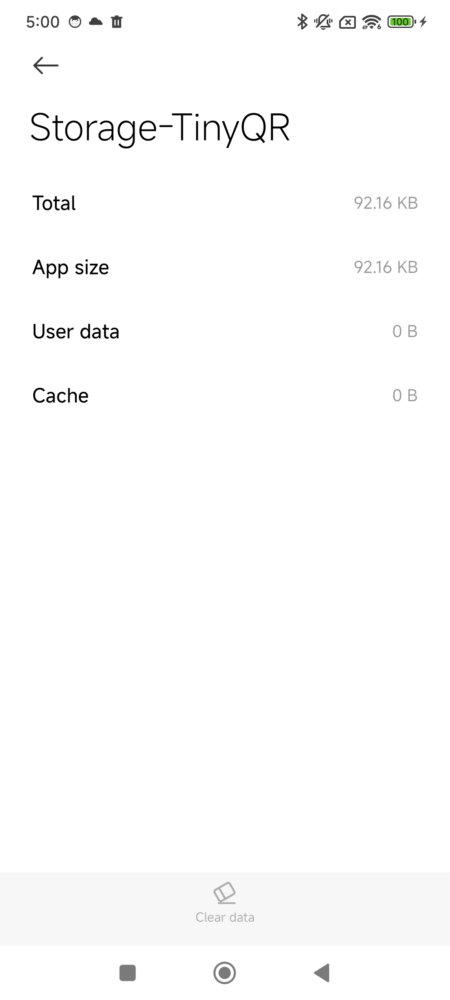

# TinyQR

TinyQR is a fully offline QR scanner for Android with a 69.00 KiB unsigned `arm64-v8a` release APK at the v1.0.0 baseline. Written in native C with Android NDK APIs, it explores how small a practical scanner can be while remaining usable and maintainable.

<a href="https://play.google.com/store/apps/details?id=com.xiao.tinyqr"></a>

## Highlights

- Native `NativeActivity` using Camera2 NDK and `AImageReader`.
- On-device QR decoding with vendored `quirc`; no `INTERNET` permission.
- No Java or Kotlin application source, AndroidX, CameraX, Google Play Services, or analytics.
- Android 7.0+ (`minSdk 24`); currently `arm64-v8a` only.

## Screenshots

| Scanner | Result |
|:---:|:---:|
|  |  |

## Size

The v1.0.0 measurement is the initial public size baseline for the unsigned release APK.

| Version | ABI | APK | `libtinyqr.so` |
|---|---|---:|---:|
| v1.0.0 | arm64-v8a | 70,652 B (69.00 KiB) | 50,848 B (49.66 KiB) |

The original measurement included recorded working-tree changes and was not a clean-commit build. See [BENCHMARK.md](BENCHMARK.md) for provenance, methodology, and reproduction instructions.

One Android Settings screenshot reports 92.16 KB for both total storage and app size. This device reading is separate from the unsigned APK measurement above.



## How it works

`Camera2 NDK` and `AImageReader` supply YUV frames. Native code displays a grayscale preview through `ANativeWindow` and sends the Y plane to the vendored [quirc](app/src/main/c/third_party/quirc/UPSTREAM.md) decoder. A successful scan opens a native result screen with copy and rescan actions. Camera permission and clipboard access use small JNI bridges to Android framework APIs.

The normal decoder path includes a mirror retry. If normal candidates fail, a bounded fallback can reconstruct finder geometry for some rounded or stylized QR codes; ambiguous geometry is rejected. QR payloads are not logged.

The supported build uses Gradle and CMake. Its native release flags include `-Oz`, LTO, hidden visibility, section garbage collection, and symbol stripping; the optional `TINYQR_CHALLENGE_BUILD` profile is off. The separate [`experimental/raw-build/`](experimental/raw-build/README.md) script explores direct NDK packaging and is not the supported build.

## Build

Open this directory in Android Studio, install the SDK/NDK components requested by the project, and run the `app` configuration on an `arm64-v8a` device. The project uses Gradle 9.5.0, Android Gradle Plugin 9.3.0-rc01, compile/target SDK 36, and CMake 3.22.1. A local SDK location can be supplied through Android Studio or an ignored `local.properties` file; do not commit machine-specific paths.

From the project root, build with:

```powershell
.\gradlew.bat :app:assembleDebug
.\gradlew.bat :app:assembleRelease
```

The release Gradle task produces an unsigned APK.

## Test

Host-side decoder tests require `gcc` on `PATH`:

```powershell
.\tests\run_qr_decoder_test.ps1
```

The decoder suite covers standard QR cases, rotation, mirroring, row stride, damaged data, reuse, and negative cases. An optional development photo for stylized QR verification is not distributed; its regression case reports a skip when absent. The explicitly requested stylized-photo benchmark requires that fixture. Other native and static checks are in [`tests/`](tests/).

## Repository layout

- [`app/src/main/c/`](app/src/main/c/) — native application, camera, QR decoding, rendering, and vendored quirc.
- [`app/src/main/AndroidManifest.xml`](app/src/main/AndroidManifest.xml) and [`app/src/main/res/`](app/src/main/res/) — Android entry point and resources.
- [`tests/`](tests/) — host-side decoder, math, rendering, and static checks.
- [`tools/`](tools/) — APK size reporting and release measurement.
- [`CHANGELOG.md`](CHANGELOG.md) — release history.

## License

TinyQR is licensed under the repository's existing [MIT license](LICENSE). quirc's ISC license and upstream details are preserved in [`app/src/main/c/third_party/quirc/`](app/src/main/c/third_party/quirc/), and its notice is packaged in [`THIRD_PARTY_NOTICES.txt`](app/src/main/assets/THIRD_PARTY_NOTICES.txt).
